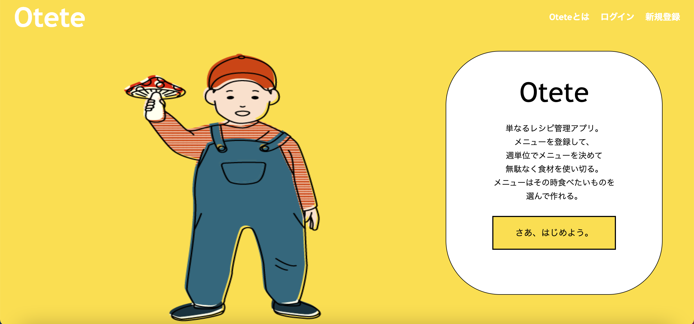
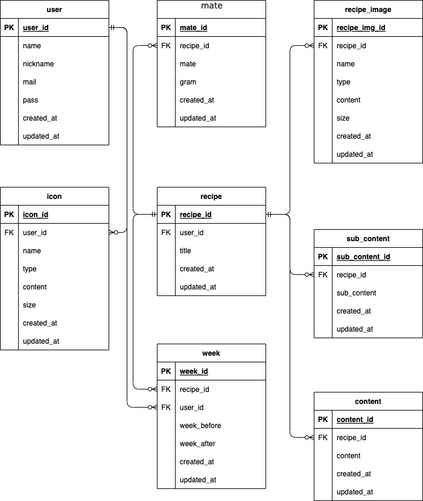
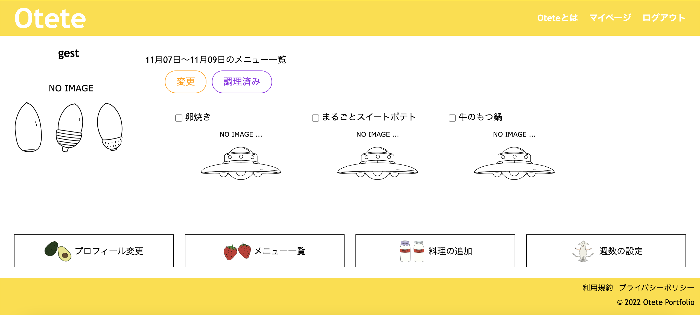
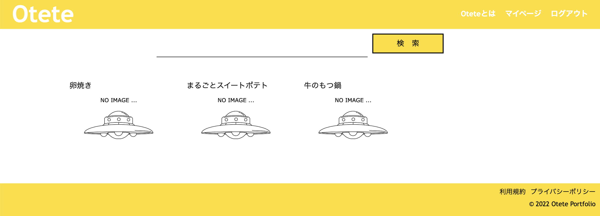

# レシピ管理アプリ「おてて」

# 1.アプリの概要
#### レシピの管理、そのレシピの中から献立を決めれるWebアプリケーション
です。

毎日の献立を決める際、私は今までノートに全て作り方を記入し、その中から2週間分の献立を決めノートに書き留めていました。

ですが、それを続けているうちに以下の困りごとがありました。

#### ・何を作ったか書き留めるのを忘れてしまう。
#### ・ノートが３ヶ月も満たない間に2冊まで増えてしまい、管理が大変。
#### ・手書きのため、14品を書くのは手が痛いし、時間を取られがち。

この困りごとを解決し、もっと時間を有効に使いたいという思いでアプリを作成しました。

# 2.使用技術
### フロントエンド
・HTML 
・CSS 
・jQuery 3.3.1 

### バックエンド
・PHP 8.1.11 
・MySQL 8.0.28 
・composer 2.2.7 

### その他
・PHPMyAdmin 
・VSCode 

# 3.ER図

# 4.アプリの特徴
### ・ユーザーページで献立を表示
その週や日数で設定した献立を分かりやすく一覧に表示し、調理したものは調理済みボタンで削除し、 
見て何のレシピが残っているか確認できます。

レシピ一覧では検索機能がついているので残った材料やタイトルを調べたり、
写真も投稿できるので、食べたいものを選びやすくしました。

# 5.アプリの機能一覧
### メイン機能
#### 　・レシピ登録
#### 　・レシピ検索
#### 　・レシピの編集、削除
#### 　・週数ごとの献立の登録
#### 　・週数ごとの献立の編集、削除

### 認証機能
#### 　・ユーザー登録、ログイン、ログアウト
#### 　・ゲストログイン
#### 　・パスワード再設定
#### 　・プロフィール編集
#### 　・退会

# 6.勉強に利用したwebまたは書籍
### 　・独習PHP 第3版
### 　・PHP本格入門　下
### 　・プロゲート
### 　・Google